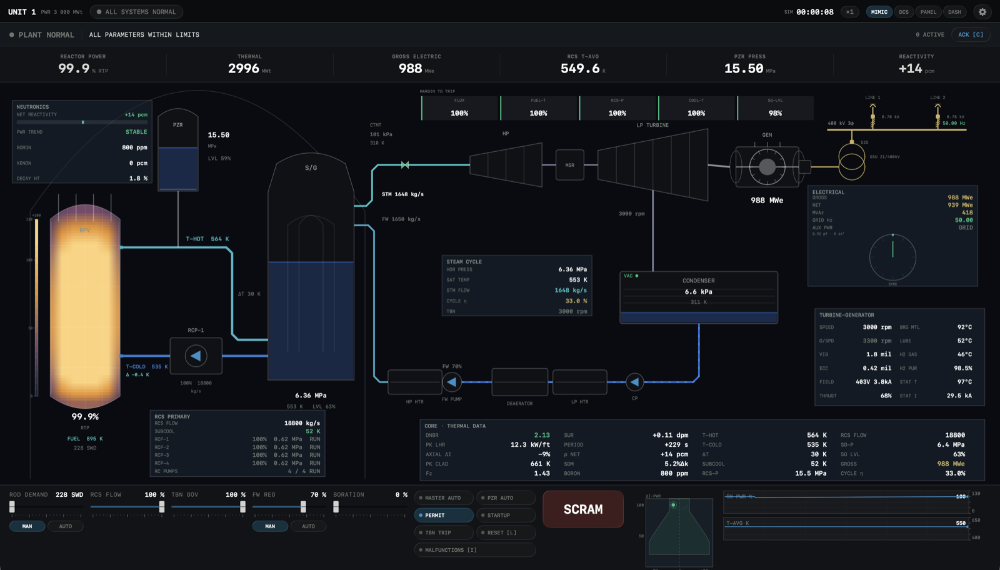

# ReactorSim

A native macOS reactor training simulator — a full control room for a
1000 MWe pressurized-water plant (with BWR and SMR variants), rendered as a
live 120 Hz plant mimic. Real reactor kinetics, thermal-hydraulics, and a
protection system underneath; a gorgeous, minimalist glass HMI on top.



## What it is

One physics model drives four swappable operator consoles. The reactor runs
continuously — power, temperatures, pressures, flows, reactivity, and xenon
all evolve from coupled ODEs, not scripted animation. You withdraw rods,
adjust boron, load the turbine, and the plant responds the way a real one
would; trip it and the annunciators latch, the horn sounds, the PA calls it
out, and the rods drop.

- **Point + axial-nodal neutronics** — six-group delayed kinetics with a
  15-node axial core (chopped-cosine flux), per-node xenon/iodine, Doppler and
  moderator feedback, and a 3-ring + azimuthal radial model (QPTR, axial
  offset, Fq/FΔH all live).
- **Two-region thermal-hydraulics** — Dittus–Boelter fuel-to-coolant heat
  transfer, transport delays, an evaporator-coupled steam generator, and a
  self-regulating balance-of-plant stable to 600× time compression.
- **Protection + BOP** — reactor/turbine trips, ECCS, pressurizer PORV/spray,
  a 400 kV switchyard with click-to-operate breakers, a LOOP → diesels →
  station-blackout aux-power ladder, containment, and an infinite-bus
  synchronous generator.
- **Instructor station** — a malfunction menu (rod drop, stuck rod, SGTR,
  ATWS, LOCA, loss of a coolant pump, MSIV closure, diesel failure, station
  blackout) for running scenarios.

## Physics calibration

The core reactivity constants are anchored to **Monte Carlo neutron transport**
(OpenMC + ENDF/B-VII.1): boron worth, Doppler and moderator temperature
coefficients, and the integral rod-worth shape are all transport-derived rather
than hand-tuned. The pipeline lives in [`calibration/`](calibration/) and emits
`calibration.json`, which the app loads at startup. See that directory's README
for provenance. Everything is a training-grade reduced-order model — faithful
in behavior, not a licensing-grade code.

## Build & run

```sh
swift build -c release        # release build (needed for smooth 600× speed)
swift run ReactorSim          # or: ./.build/release/ReactorSim
swift test                    # 33 headless physics/supervisor tests
```

To build a double-clickable `ReactorSim.app` with an icon:

```sh
scripts/make-app.sh           # → dist/ReactorSim.app
```

Requires **macOS 26 (Tahoe)** for the Liquid Glass APIs.

## Consoles & skins

Four consoles (switch in the system bar or with the `DCS`/`PANEL`/`DASH` tabs):
**Plant Mimic** (the schematic above), **DCS Workstation**, **Hardware
Benchboard**, and **Engineering Dashboard**. Three skins cycle with `M`:
**Guided** (Liquid Glass), **Authentic Light**, and **Authentic Dark**
(flat ISA-101 high-performance HMI). Three reactor kinds — PWR, BWR, SMR — in
Settings.

## Keyboard

| Key | Action | Key | Action |
|-----|--------|-----|--------|
| `W`/`S` | rods out / in | `Space` | SCRAM (again = reset) |
| `A`/`D` | RCS flow − / + | `C` | acknowledge alarms |
| `Q`/`E` | turbine valve − / + | `L` | reset scram |
| `F`/`V` | feedwater − / + | `U` | auto-startup sequencer |
| `B`/`G` | boron in / out | `O` | rod auto (T-avg program) |
| `I` | instructor / malfunctions | `P` | startup permit |
| `M` | cycle skin | `T` | turbine trip |
| `,` | settings | `+`/`-` | sim speed (×1…×600) |
| `Esc` | pause (closes popups first) | `F1`–`F6` | dashboard tabs |

Hold **Shift** with a control key for a coarse (5%) step. Click the vessel for
the core map, the **NEUTRONICS** dock for the startup panel (1/M, ECP, rod
worth), and the switchyard breakers to operate them.

---

*Training simulator — not for real-plant use.*
